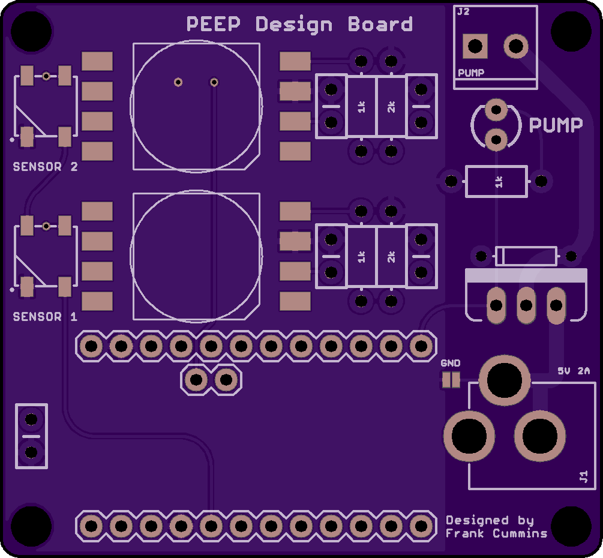

# PEEPS-Hardware
Repository for the NU Segal Design School Students PEEP project hardware

## Description
This printed circuit board (PCB) is designed to make use of NXP's [MPXV7002 Integrated Silicon Pressure Sensor](https://www.nxp.com/docs/en/data-sheet/MPXV7002.pdf) to measure and record pressure at as many as two points in the PEEP apparatus. It also includes a simple driver for an [air pump](https://www.adafruit.com/product/4699) that can generate up to 2.5 L/min of air flow. The microcontroller takes pressure readings at 100Hz and transmits them over a serial UART port to be analyzed in real-time or offline. The controller can activate the air pump through this serial interface as well.   This board will be used to verify the student design's functionality against the industry standard. It uses primarily through-hole components for ease and speed of assembly.

